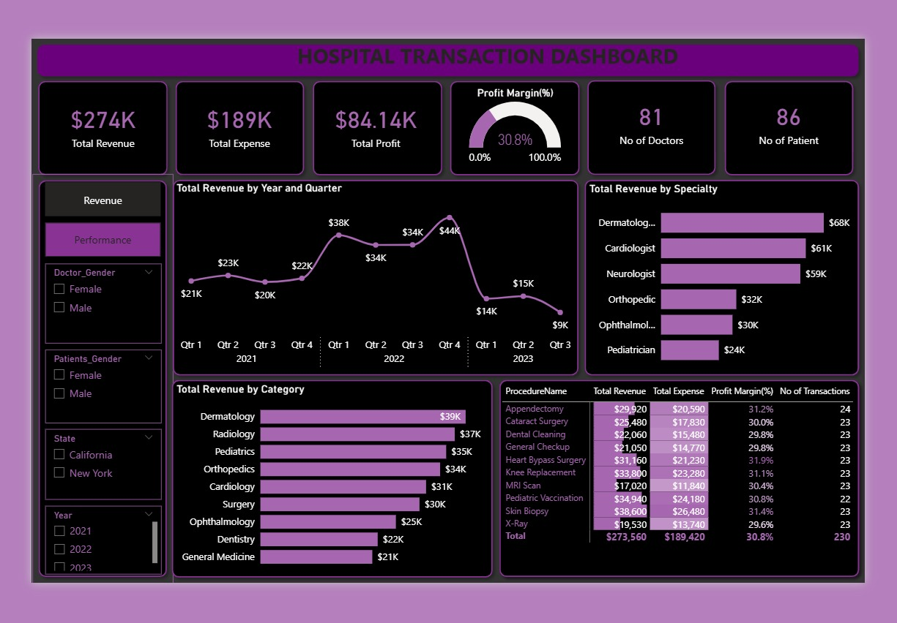

# Hospital-Transaction-Dashboard
The Hospital report dashboard summarizes the hospital’s financial performance, patient activity, doctor distribution, and service revenue. It shows profitable operations, led by Dermatology, Cardiology, and Neurology, but highlights a recent decline in revenue and patient visits that management should address.
# Table of Contents

1. [Introduction](#introduction)
2. [Problem Statement](#problem-statement)
3. [Project Overview](#project-overview)
4. [Hospital Revenue Dashboard](#hospital-revenue-dashboard)
5. [Hospital Performance Dashboard](#hospital-performance-dashboard)
6. [Recommendation](#recommendation)
7. [Conclusion](#conclusion)

---

# Introduction

The hospital transaction dashboard provides a detailed view of the hospital’s financial and operational performance. It presents key business metrics such as total revenue, total expense, total profit, profit margin, number of doctors, number of patients, and total transactions.

The dashboard is divided into two main sections: the **Hospital Revenue Dashboard** and the **Hospital Performance Dashboard**. Together, they help management understand revenue trends, specialty performance, procedure profitability, doctor contribution, patient contribution, and patient visit patterns over time.

---

# Problem Statement

Hospitals generate large volumes of transaction data from different departments, procedures, doctors, and patients. Without a clear reporting system, it can be difficult for management to identify which services are profitable, which specialties generate the highest revenue, and where performance is declining.

The key problem addressed by this dashboard is the need to monitor hospital revenue, expenses, profit, patient visits, and doctor performance in one place. The dashboard also helps identify areas that require management attention, especially the decline in revenue and patient visits in the most recent year.

---

# Project Overview

This project focuses on analyzing hospital transaction data to support better business decisions. The dashboard provides an interactive view of hospital performance across different years, quarters, specialties, procedures, doctors, patients, gender categories, and states.

The main objective is to help hospital management track financial health, understand revenue drivers, measure profitability, and evaluate operational performance. Filters such as doctor gender, patient gender, state, and year allow users to explore the data from different perspectives.

The dashboard shows that the hospital is profitable overall, with a positive profit margin. However, it also reveals a decline in both revenue and patient visits in 2023, which may require further investigation.
## Hospital Revenue Dashboard

---

# Hospital Revenue Dashboard

The Hospital Revenue Dashboard focuses on the financial performance of the hospital. It shows total revenue of **$274K**, total expense of **$189K**, and total profit of **$84.14K**. The hospital achieved a profit margin of **30.8%**, indicating that it is operating profitably.

Revenue performance by year and quarter shows that revenue was relatively stable in 2021, improved strongly in 2022, and declined significantly in 2023. The highest revenue point occurred in **Q4 2022**, while the lowest revenue point appeared in **Q3 2023**. This trend suggests that the hospital experienced strong growth before facing a sharp drop in recent performance.

By specialty, **Dermatology**, **Cardiology**, and **Neurology** are the leading revenue-generating specialties. Dermatology recorded the highest revenue, followed closely by Cardiology and Neurology. Lower revenue was observed in specialties such as Pediatrics, Ophthalmology, and Orthopedics.

The revenue by category also shows strong performance in Dermatology, Radiology, Pediatrics, Orthopedics, and Cardiology. This indicates that revenue is spread across several medical service categories, although some areas contribute more strongly than others.

The procedure-level table shows that most procedures maintain a stable profit margin of around **30% to 32%**. This means the hospital has fairly consistent profitability across different services. However, the total number of transactions suggests that increasing patient volume could improve overall revenue and profit.

---

# Hospital Performance Dashboard

The Hospital Performance Dashboard focuses on operational activity, including doctor performance, patient contribution, gender distribution, specialty distribution, and patient visits over time.

The dashboard shows that the hospital has **81 doctors** and **86 patients**. Doctor distribution is slightly higher among male doctors, while patient distribution is slightly higher among female patients.

The top doctors by revenue include **Ava Adams**, **Liam Turner**, and other high-performing doctors. Ava Adams generated the highest revenue among doctors, showing strong individual contribution to hospital income.

The top patients by revenue also contribute significantly to total income. This view helps management understand patient-level revenue concentration and identify high-value patient segments.

Patient visits by year and quarter show that visits were stable in 2021, increased in 2022, and then declined sharply in 2023. This pattern is similar to the revenue trend, suggesting that the decline in revenue may be linked to lower patient visits.

The specialty comparison between doctors and patients shows that Neurology has the highest number of patients, while Dermatology has the highest number of doctors among the listed specialties. This can help management assess whether staffing levels are properly aligned with patient demand.

---

# Recommendation

Management should investigate the cause of the decline in revenue and patient visits in 2023. This may involve reviewing patient acquisition, service demand, pricing, doctor availability, appointment scheduling, and external market factors.

The hospital should strengthen high-performing specialties such as Dermatology, Cardiology, and Neurology, as these areas generate strong revenue. Additional marketing, improved service delivery, and resource allocation can help sustain their performance.

Lower-performing specialties should also be reviewed to identify opportunities for improvement. Management may need to assess whether these departments require better promotion, improved staffing, upgraded equipment, or revised service pricing.

Since patient visits appear closely connected to revenue performance, the hospital should focus on increasing patient engagement and retention. This can include follow-up care programs, patient satisfaction tracking, referral campaigns, and improved appointment accessibility.

The hospital should also monitor doctor-level performance regularly. High-performing doctors can be studied to understand best practices, while lower-performing areas can receive targeted support and training.

---

# Conclusion

The hospital transaction dashboard provides valuable insight into the hospital’s financial and operational performance. Overall, the hospital is profitable, with a healthy profit margin and strong revenue contributions from key specialties.

However, the dashboard also highlights a major concern: revenue and patient visits declined sharply in 2023. This trend should be addressed quickly to protect future profitability and operational growth.

By focusing on patient volume, strengthening high-performing specialties, improving weaker service areas, and monitoring doctor and procedure performance, the hospital can improve decision-making and support long-term business growth.
